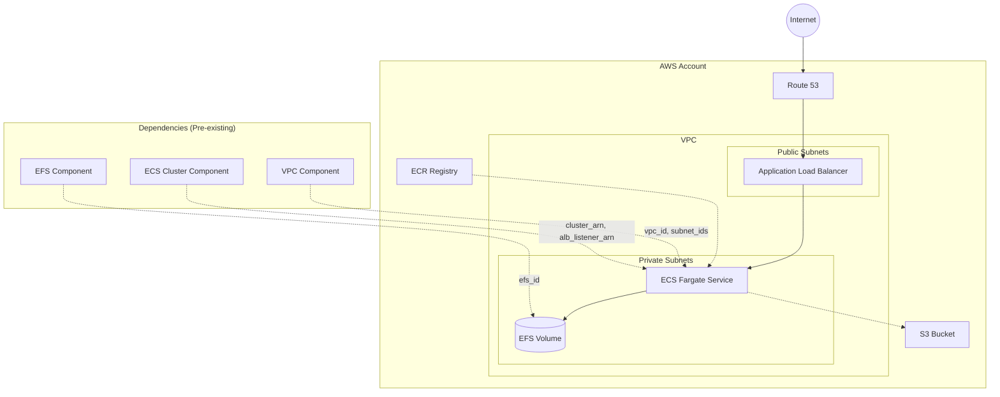
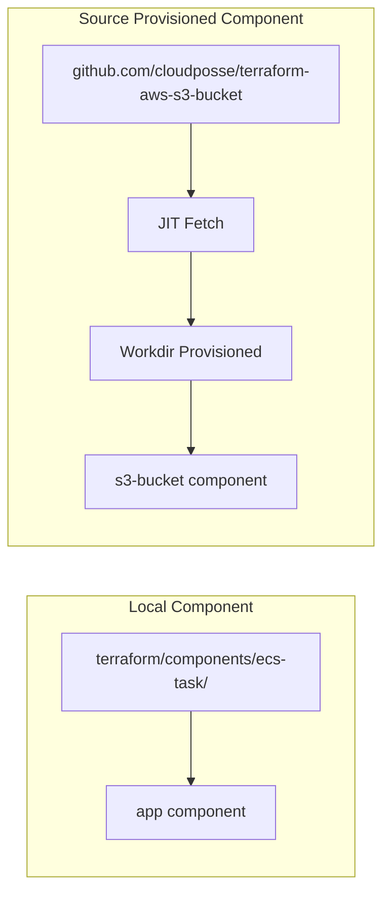

# atmos-native-ci <a href="https://cloudposse.com/"></a>


[](https://github.com/cloudposse-examples/atmos-native-ci/releases/latest)
[](https://github.com/cloudposse-examples/atmos-native-ci/commits/main/)
[](https://slack.cloudposse.com)


Example application deployed to AWS ECS using [Atmos](https://atmos.tools) and [OpenTofu](https://opentofu.org).

This repository demonstrates deploying a self-contained application and its S3 backing service to AWS, showcasing two component provisioning strategies side by side:

- **`app` (ECS task)** - A local component checked into the repository under `terraform/components/ecs-task/`, managed directly in the codebase
- **`s3-bucket`** - A remote component pinned to a GitHub source, provisioned just-in-time via [Atmos source provisioning](https://atmos.tools/core-concepts/components/source-provisioning) with workdir provisioning - no local Terraform code required

CI/CD pipelines use [`atmos describe affected --format=matrix`](https://atmos.tools/cli/commands/describe/affected) to dynamically detect which components changed and dispatch parallel deploy jobs for each affected component+stack pair.


## Introduction

### Application

A simple Go web server designed to demonstrate container deployment strategies. Each request increments a counter, and the background color is configurable - making it easy to visualize blue/green deployments and load balancing. The `/dashboard` endpoint displays a grid of auto-refreshing iframes to show traffic distribution across instances. See [`app/`](app/) for details.

### Infrastructure



### Component Provisioning

This project demonstrates two ways to provision Terraform components with Atmos:



| Component | Provisioning | Source | Description |
|-----------|-------------|--------|-------------|
| `app` | Local | `terraform/components/ecs-task/` | ECS Fargate service - checked into the repo, managed directly |
| `s3-bucket` | Remote (JIT) | `github.com/cloudposse/terraform-aws-s3-bucket` | S3 bucket - pinned to a remote module, fetched on demand |

The `s3-bucket` component uses [source provisioning](https://atmos.tools/core-concepts/components/source-provisioning) to fetch the Terraform module from GitHub at plan/apply time and [workdir provisioning](https://atmos.tools/core-concepts/components/source-provisioning) to manage the working directory. This means there is no local Terraform code for S3 - the configuration lives entirely in the stack YAML:

```yaml
# terraform/stacks/defaults/s3-bucket.yaml
components:
  terraform:
    s3-bucket:
      source:
        uri: "github.com/cloudposse/terraform-aws-s3-bucket//."
        version: "main"
      provision:
        workdir:
          enabled: true
      vars:
        name: demo
        versioning_enabled: true
```

This project uses:

- **[Atmos](https://atmos.tools)** - Configuration orchestration and stack management
- **[OpenTofu](https://opentofu.org)** - Infrastructure as Code (Terraform-compatible)
- **AWS ECS Fargate** - Serverless container orchestration
- **AWS ECR** - Container image registry
- **AWS S3** - Object storage (backing service)
- **AWS EFS** - Persistent file storage (optional)


## Usage

### Local Development

Run the application locally using Podman Compose:

```bash
# Start the app locally (builds and runs on http://localhost:8080)
atmos up

# Stop the app
atmos down
```

### CI/CD Workflows

See [`.github/workflows/`](.github/workflows/) for detailed workflow diagrams.

All deploy workflows use `atmos describe affected --format=matrix` to detect which components changed and deploy only what's needed, in parallel.

| Workflow | Trigger | Action |
|----------|---------|--------|
| `main-branch.yaml` | Push to `main` | Build image → Detect affected → Deploy to dev → Create draft release |
| `release.yaml` | Published release | Promote image → Detect affected → Deploy to staging and prod |
| `feature-branch.yml` | PR with `deploy` label | Build image → Detect affected → Deploy to preview environment |
| `preview-cleanup.yml` | PR closed | Destroy preview environment |

### Deployment

#### Prerequisites

- [Atmos](https://atmos.tools/install) installed
- [OpenTofu](https://opentofu.org/docs/intro/install/) installed
- AWS credentials configured

#### Infrastructure Dependencies

Before deploying, you must have the following infrastructure deployed:

1. **VPC** - With public/private subnets
2. **ECS Cluster** - With an Application Load Balancer (ALB) and DNS records configured
3. **EFS** (optional) - For persistent storage volumes

Then configure the dependencies in `terraform/stacks/`. You have two options:

**Option 1: Use `!terraform.state` (recommended)**

Update the dependency configurations in `terraform/stacks/deps/` to point to your infrastructure's remote state:
- `deps/vpc.yaml` - VPC component remote state location
- `deps/ecs.yaml` - ECS cluster component remote state location
- `deps/efs.yaml` - EFS component remote state location (if using volumes)

**Option 2: Hardcode values (brownfield)**

Replace the `!terraform.state` lookups in `terraform/stacks/defaults/app.yaml` with hardcoded values for your infrastructure. See [`terraform/stacks/defaults/README.md`](terraform/stacks/defaults/README.md) for required variables and a complete example.

#### Local Deployment

```bash
# Deploy all components to dev
atmos terraform deploy app -s dev
atmos terraform deploy s3-bucket -s dev

# Deploy to staging
atmos terraform deploy app -s staging
atmos terraform deploy s3-bucket -s staging

# Deploy to production
atmos terraform deploy app -s prod
atmos terraform deploy s3-bucket -s prod
```

#### CI/CD Deployment

1. Push to `main` branch → automatically detects affected components and deploys to dev
2. Create a GitHub release → automatically detects affected and deploys to staging then prod
3. Open a PR with `deploy` label → detects affected and deploys to a preview environment

### Configuration

Stack configurations are in `terraform/stacks/`. Each environment imports shared defaults and specifies environment-specific settings:

```yaml
# terraform/stacks/dev.yaml
import:
  - _default.yaml
  - defaults/app.yaml
  - defaults/s3-bucket.yaml
  - deps/*

vars:
  stage: dev
```

Container configuration is defined in `terraform/stacks/defaults/app.yaml` and S3 bucket configuration in `terraform/stacks/defaults/s3-bucket.yaml`. Both can be customized per environment.

### Repository Structure

```
.
├── app/                       # Go application
│   ├── main.go                # Web server
│   ├── Dockerfile             # Multi-stage container build
│   ├── public/                # Static HTML assets
│   ├── rootfs/                # Container filesystem overlay
│   └── test/                  # Local development (docker-compose)
├── atmos.yaml                 # Atmos configuration
├── .atmos.d/                  # Atmos custom commands
├── terraform/
│   ├── components/            # Local Terraform/OpenTofu modules
│   │   └── ecs-task/          # ECS task definition component
│   └── stacks/                # Environment configurations
│       ├── defaults/
│       │   ├── app.yaml       # ECS app config (local component)
│       │   └── s3-bucket.yaml # S3 config (source-provisioned)
│       ├── deps/              # Dependency references
│       ├── dev.yaml
│       ├── staging.yaml
│       ├── prod.yaml
│       └── preview.yaml
└── .github/
    ├── workflows/             # CI/CD pipelines (affected + matrix)
    ├── README.yaml            # README source
    └── README.md              # Generated README
```

> **Note:** The `s3-bucket` component has no directory under `terraform/components/` - it is source-provisioned from a remote GitHub module at plan/apply time.

### Building Documentation

To regenerate the README from this file, run:

```bash
atmos docs generate readme
```


## Related Projects

Check out these related projects.

- [Atmos](https://atmos.tools) - Universal Tool for DevOps and Cloud Automation
- [terraform-aws-components](https://github.com/cloudposse/terraform-aws-components) - Opinionated, self-contained Terraform root modules for Cloud Posse reference architecture


## Slack Community

Join our [Open Source Community](https://slack.cloudposse.com) on Slack. It's **FREE** for everyone! Our "SweetOps" community is where you get to talk with others who share a similar vision for how to rollout and manage infrastructure. This is the best place to talk shop, ask questions, solicit feedback, and work together as a community to build totally *sweet* infrastructure.

## Newsletter

Sign up for [our newsletter](https://cpco.io/newsletter) and join 3,000+ DevOps engineers, CTOs, and founders who get insider access to the latest DevOps trends, so you can always stay in the know. Dropped straight into your Inbox every week — and usually a 5-minute read.

## Office Hours <a href="https://cloudposse.com/office-hours"></a>

[Join us every Wednesday via Zoom](https://cloudposse.com/office-hours) for your weekly dose of insider DevOps trends, AWS news and Terraform insights, all sourced from our SweetOps community, plus a _live Q&A_ that you can't find anywhere else. It's **FREE** for everyone!

## License

<a href="https://opensource.org/licenses/Apache-2.0"></a>

Licensed under the Apache License, Version 2.0. See [LICENSE](LICENSE) for full details.

## Trademarks

All other trademarks referenced herein are the property of their respective owners.

---
Copyright © 2017-2025 [Cloud Posse, LLC](https://cloudposse.com)
