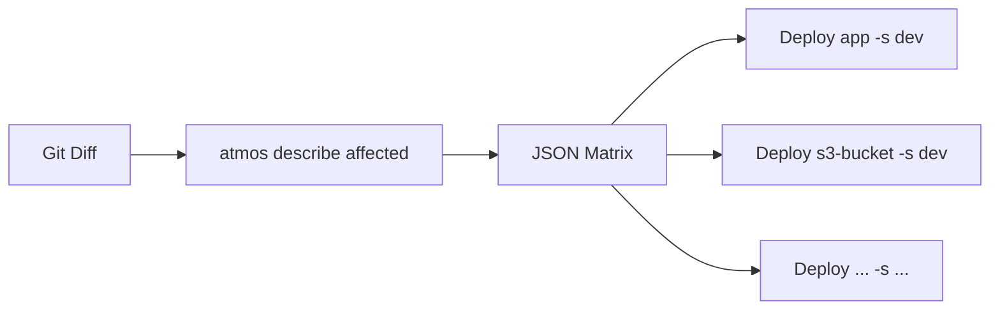
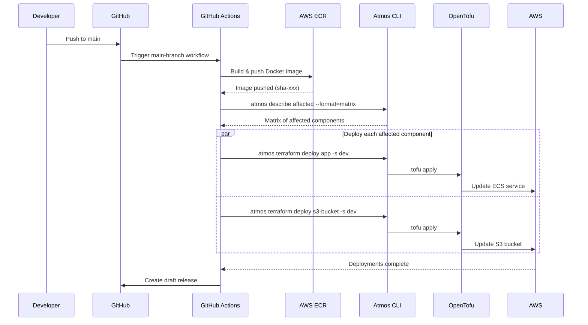
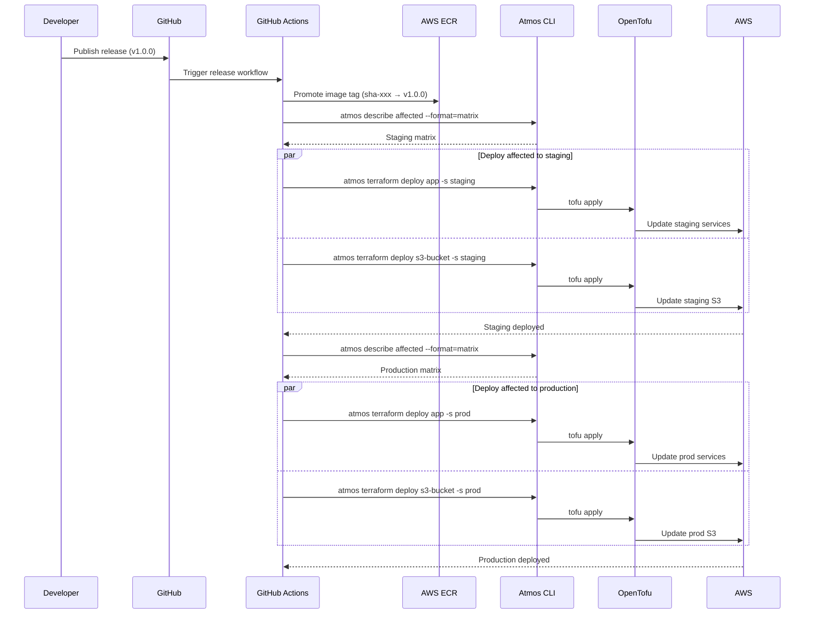
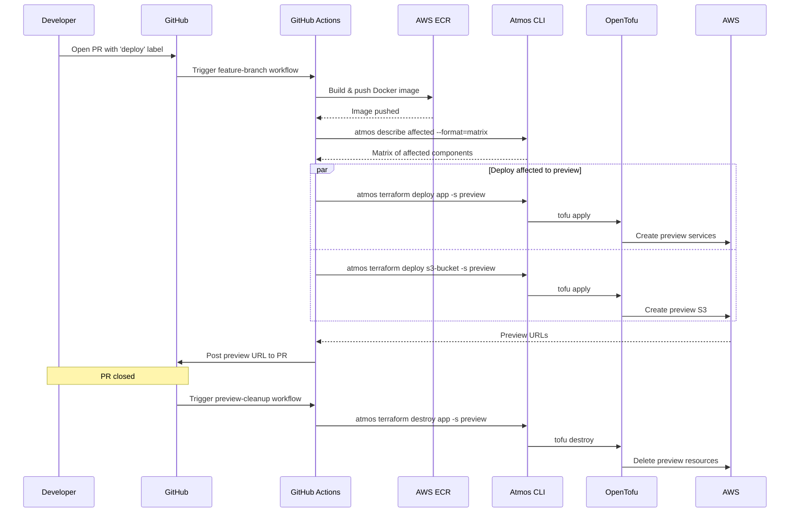
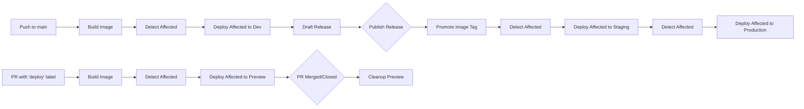

# Workflows

GitHub Actions CI/CD pipelines. All deploy workflows use `atmos describe affected --format=matrix` to dynamically detect which components changed and dispatch parallel deploy jobs.

| Workflow | Trigger | Action |
|----------|---------|--------|
| `main-branch.yaml` | Push to `main` | Build image → Detect affected → Deploy affected components to dev → Create draft release |
| `release.yaml` | Published release | Promote image → Detect affected → Deploy to staging → Deploy to prod |
| `feature-branch.yml` | PR with `deploy` label | Build image → Detect affected → Deploy affected components to preview |
| `preview-cleanup.yml` | PR closed | Destroy preview environment |
| `validate.yml` | Pull request | Run validation checks |
| `labeler.yaml` | Pull request | Auto-label based on changed files |

## How Affected Detection Works

Each deploy workflow includes an `affected` job that runs `atmos describe affected --format=matrix`. This compares the current commit against the base to identify which component+stack pairs have changed, then outputs a JSON matrix that GitHub Actions uses to fan out parallel deploy jobs.

## Main Branch Workflow

## Release Workflow

## Feature Branch Workflow (Preview Environments)

## Environment Promotion Flow

